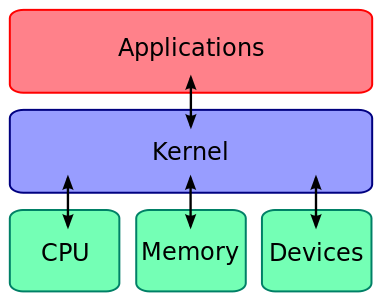
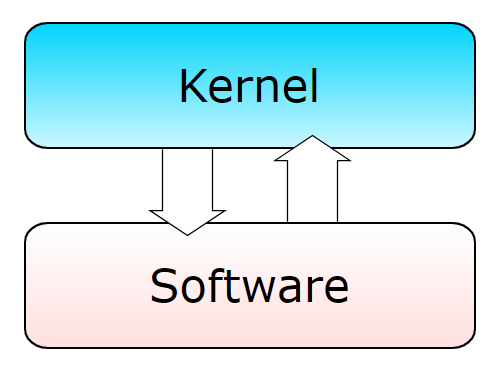
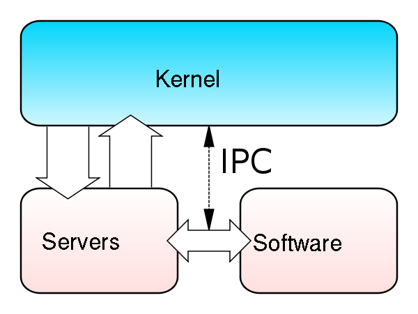
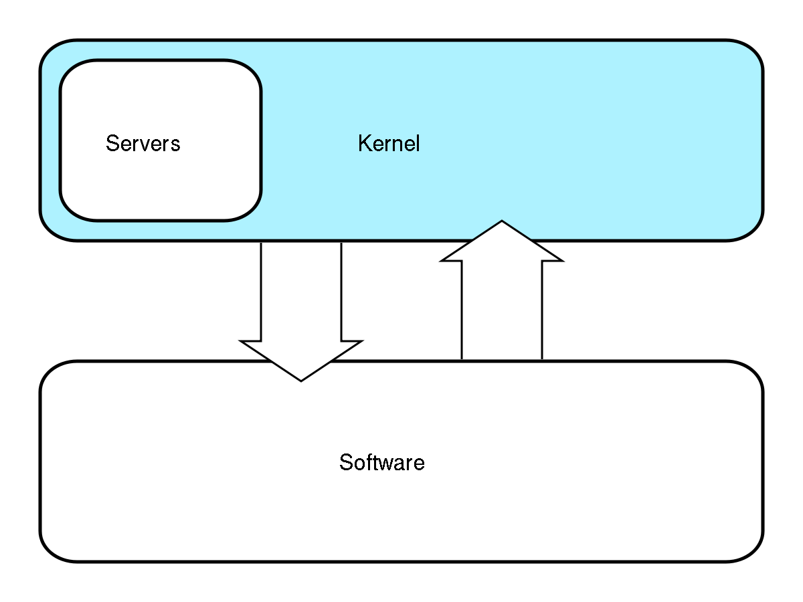
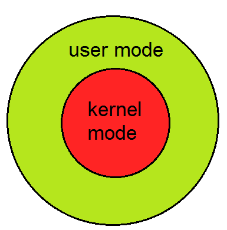
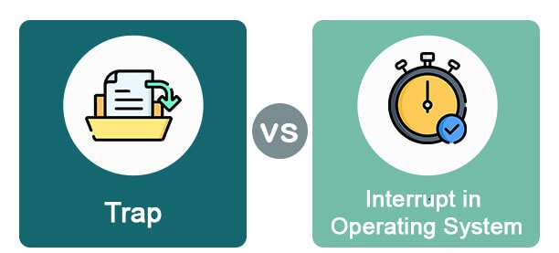

# **Tipos de Kernel y sus diferencias**

<ul>
  <li><a href='#whatKernel'><strong>¿Qué es un Kernel?</strong></a></li>
  <li><a href='#typesKernel'><strong>Tipos de Kernel</strong></a></li>
  <li><a href='#uservskernelmode'><strong>User vs Kernel Mode</a></li>
  <li><a href='#interruptionsvstraps'><strong>Interrupciones vs Trampas</strong></a></li>
</ul>

## ¿Qué es un Kernel?

El kernel es el componente central de un sistema operativo. Actúa como un intermediario entre el software y el hardware y facilita la comunicación y la gestión eficiente de los recursos del sistema. En esencia, el kernel es el supervisor encargado de coordinar las operaciones del sistema operativo y garantizar un funcionamiento coherente y seguro.

### Funciones principales

<ol>
    <li>
        
<strong>Administración de recursos: </strong> Asigna y libera recursos del sistema, como memoria y procesador, para garantizar un uso eficiente y equitativo entre las aplicaciones en ejecución.

    </li>
    <li>
        
<strong>Gestión de procesos: </strong> Supervisa la ejecución de procesos y coordina su interacción, asegurando una distribución justa del tiempo de CPU y evitando conflictos entre programas.

    </li>
    <li>
        
<strong>Comunicación con dispositivos de hardware: </strong> Facilita la interacción entre el software y los dispositivos de hardware, permitiendo la entrada y salida de datos de manera eficiente.

    </li>
    <li>
        
<strong>Seguridad y protección: </strong> Implementa políticas de seguridad para proteger el sistema operativo y los datos del usuario, asegurando que los procesos no autorizados no comprometan la integridad del sistema.

    </li>
</ol>

 

#### ¿Cómo funciona un Kernel?

Las cuatro funciones del kernel pueden derivarse de sus componentes:

<ul>
    <li>
        
Gestión del almacenamiento: controla cuánta memoria se utiliza y dónde.

    </li>
    <li>
        
Gestión de procesos: determina qué procesos puede utilizar la CPU, cuándo y durante cuánto tiempo.

    </li>
    <li>
        
Controlador de dispositivos: comunica el hardware con los procesos.

    </li>
    <li>
        
Llamadas al sistema y seguridad: recibe peticiones de servicio de los procesos.

    </li>
</ul>

Las funciones de un kernel, cuando es implementado adecuadamente, permanecen invisibles para los usuarios.

Funciona en su propio mundo, en el espacio del kernel. Los archivos, programas, juegos, navegadores, etc. en definitiva, todo lo que ve el usuario tiene lugar en el espacio del usuario. La interacción de ambos mundos se realiza a través de una interfaz de llamadas al sistema, el SCI.

#### El kernel en el sistema operativo

Para entender cómo funciona el kernel del sistema operativo, lo mejor es pensar que un ordenador está dividido en tres niveles:

<ol>
    <li>
        
<strong>Hardware:</strong>La base del sistema que consiste en la memoria, el procesador y los dispositivos de entrada y salida. La CPU realiza la lectura y escritura de código al igual que los cálculos que requiere la memoria.

    </li>
    <li>
        
<strong>Kernel:</strong>El núcleo de un sistema operativo. Indica a la CPU lo que debe hacer.

    </li>
    <li>
        
<strong>Procesos de usuario:</strong>Todos los procesos en ejecución que gestiona el kernel. El kernel permite la comunicación entre procesos y servidores, también conocida como comunicación entre procesos (IPC).

    </li>
</ol>

### Tipos de Kernel

Existen tres tipos de kernel, estos son:

<table>
    <thead>
        <tr>
            <td>Tipo</td>
            <td>Descripción</td>
            <td>Ejemplos</td>
            <td>IMG</td>
        </tr>
    </thead>
    <tbody>
        <tr>
            <td>Monolítico</td>
            <td>Es un Kernel de gran tamaño que puede gestionar todas las tareas. Se encarga de la gestión de memoria y procesos, así como de la comunicación entre los procesos y el soporte de las diferentes funciones de los drivers y el hardware. Los sistemas operativos que recurren al Kernel monolítico son Linux, OS X y Windows</td>
            <td>DOS, MacOS, OpenVMS, Multics</td>
            <td>
 
</td>
        </tr>
        <tr>
            <td>Microkernel</td>
            <td>Este tipo de kernel se mantiene pequeño y solo contiene las funciones más fundamentales, como la gestión de memoria y la planificación de procesos. Otras funciones, que no son esenciales para el funcionamiento básico del sistema, se ejecutan como procesos fuera del kernel, en modo de usuario. Esto aumenta la estabilidad y la seguridad del sistema, ya que las fallas en los servicios externos no afectarán al núcleo.</td>
            <td>AIX, Hurd, L4, Minix, SymbianOS</td>
            <td>
 
</td>
        </tr>
        <tr>
            <td>Kernel híbrido</td>
            <td>El kernel híbrido combina características del kernel monolítico y del microkernel. Parte del código es ejecutado en modo kernel (modo privilegiado) para obtener acceso directo al hardware y garantizar un rendimiento óptimo, mientras que otras partes se ejecutan en modo de usuario para mejorar la modularidad y la estabilidad del sistema.
            </td>
            <td>Windows NT, XNU (macOS), ReactOS</td>
            <td>
 
</td>
        </tr>
    </tbody>
</table>

### Diferencias

<table>
    <thead>
        <tr>
            <td>Kernel Monolítico</td>
            <td>Microkernel</td>
            <td>Kernel Hibrido</td>
        </tr>
    </thead>
    <tbody>
        <tr>
            <td>Posee un gran nucleo para poder realizar todas las tareas del sistema.</td>
            <td>Posee un nucleo compacto, por lo que brinda un conjunto de abstracciones basicas del hardware.</td>
            <td>Posee un micronúcleo que tiene algo de código «no esencial» en espacio de núcleo, para que este se ejecute más rápido.</td>
        </tr>
        <tr>
            <td>Se encuentra en modo supervisor.</td>
            <td>Se encuentra en modo usuario.</td>
            <td>Se puede elegir qué acciones ejecutar en modo usuario, y cuáles en modo supervisor.</td>
        </tr>
        <tr>
            <td>Es de tipo no modular y puede alcanzar mayor rendimiento que un microkernel.</td>
            <td>Es de tipo modular, es decir, que está dividido en modulos.</td>
            <td>Posee el diseño más simple del núcleo monolítico con la modularidad.</td>
        </tr>
    </tbody>
</table>

## USER VS KERNEL MODE

 

En un sistema operativo, existen dos niveles de acceso y privilegios en los que los programas y procesos pueden operar: el Modo de Usuario y el Modo Kernel. Estos modos representan niveles diferentes de acceso a los recursos del sistema y se utilizan para garantizar la seguridad y la estabilidad del sistema. Las principales diferencias de estos modos son:

<table>
    <thead>
        <tr>
            <td>El programa de aplicación se ejecuta y se inicia.</td>
            <td>El programa tiene acceso directo y sin restricciones a los recursos del sistema.</td>
        </tr>
    </thead>
    <tbody>
        <tr>
            <td>Un proceso falla si se produce una interrupción</td>
            <td>Todo el sistema operativo podría dejar de funcionar si se produce una interrupción.</td>
        </tr>
        <tr>
            <td>Se le conoce como modo sin privilegios, modo restringido o modo esclavo.</td>
            <td>Se le conoce como modo maestro, modo privilegiado o modo sistema.</td>
        </tr>
        <tr>
            <td>Todos los procesos obtienen espacio de direcciones virtuales separados.</td>
            <td>Todos los procesos comparten un único espacio de direcciones virtuales.</td>
        </tr>
        <tr>
            <td>Las aplicaciones tienen menos provilegios.</td>
            <td>Las aplicaciones tienen más privilegios.</td>
        </tr>
        <tr>
            <td>Necesita acceder a los programas del kernel, ya que no puede acceder directamente a ellos.</td>
            <td>Puede acceder tanto a los programas de usuario como a los programas del kernekl, sin restricciones.</td>
        </tr>
    </tbody>
</table>

## INTERRUPTIONS VS TRAPS

 

En el tema de sistemas operativos, las interrupciones (interrupts) y las trampas (traps) son mecanismos utilizados para manejar eventos que requieren atención del sistema operativo. Aunque comparten ciertas similitudes, también tienen diferencias clave en cuanto a su origen y su propósito. A continuación, una descripción de las diferencias entre interrupciones y trampas:

<table>
  <thead>
    <tr>
      <th>Característica</th>
      <th>Interrupciones</th>
      <th>Trampas</th>
    </tr>
  </thead>
  <tbody>
    <tr>
      <td><strong>Origen</strong></td>
      <td>Eventos generados por hardware o dispositivos externos.</td>
      <td>Eventos generados por software, a menudo en respuesta a instrucciones específicas.</td>
    </tr>
    <tr>
      <td><strong>Propósito</strong></td>
      <td>Manejar eventos externos al procesador (E/S, temporizadores, hardware).</td>
      <td>Cambiar el control del programa a rutinas específicas en el sistema operativo (errores, llamadas al sistema).</td>
    </tr>
    <tr>
      <td><strong>Fuente de Activación</strong></td>
      <td>Activadas por eventos externos, como señales de hardware.</td>
      <td>Activadas por instrucciones específicas en el código del programa.</td>
    </tr>
    <tr>
      <td><strong>Privilegios y Contexto</strong></td>
      <td>Pueden cambiar el contexto y privilegios del sistema operativo.</td>
      <td>Se utilizan para cambiar a un modo privilegiado del sistema operativo (modo kernel).</td>
    </tr>
  </tbody>
</table>