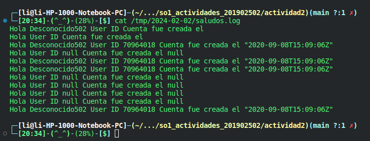

<h1> <center> Actividad #2 </center> </h1>

<p align="justify">Vamos a empezar creando nuestro archivo:</p>

`activity_two.sh`

<p align="justify">Ahora le damos los permisos de ejecuciòn adecuados</p>

```bash
chmod +x activity_two.sh
```

<p align="justify">Bien ahora instalamos las librerias necesarias para interpretar y manipular el JSON de respuesta.</p>

```bash
sudo apt-get update
sudo apt-get install jq
```

<p align="justify">Una vez instalada la libreria, vamos a colocar el siguiente contenido para el script:</p>


```bash
# !/bin/bash
read GITHUB_USER
curl -s https://api.github.com/users/$GITHUB_USER > githubUser.json
# Almacenar los valores
export GITHUB_ID=$(jq .id githubUser.json)
export GITHUB_DATE=$(jq .created_at githubUser.json)
# Crear mensaje
export MESSAGE="Hola $GITHUB_USER User ID $GITHUB_ID Cuenta fue creada el $GITHUB_DATE"
# Escribir mensaje en pantalla
echo $MESSAGE
# Escribir mensaje en archivo
path="/tmp/$(date +%Y-%m-%d)"
mkdir -p "$path"
logfile="$path/saludos.log"
touch "$logfile"
echo $MESSAGE >> $logfile
```

<h2> <center> Cron Job </center> </h2>

<p align="justify">Para la creacion de un cronjob se debe ejecutar el comando "crontab -e", dentro de este se debe escribir la siguiente instrucción:</p>

`*/5 * * * * /bin/sh actividad2.sh`

<ul>
    <li><p align="justify">"*/5" representa que el script se ejecutará cada 5 minutos.</p></li>
    <li><p align="justify">El resto de "*" representan que se hará cualquier día, de cualquier mes.</p></li>
    <li><p align="justify">"La ruta indica el script que se ejecutará.</p></li>
</ul>

<p align="justify">Para poder guardar los cambios presionar <b>Ctrl+o</b>, para indicar el nombre del cronjob presionar enter y para salir presionar <b>Ctrl+x</b>. Finalmente para verificar que se haya guardado el cronjob se hace escribiendo el comando <b>"crontab -l"</b>, el cual lista los cronjobs existentes.</p>

```bash
┌─[li@li-HP-1000-Notebook-PC]─(~/.../so1_actividades_201902502/actividad2)(main ?:1 ✗)
└─[20:13]-(^_^)-(28%)-[$] crontab -l
# Edit this file to introduce tasks to be run by cron.
# 
# Each task to run has to be defined through a single line
# indicating with different fields when the task will be run
# and what command to run for the task
# 
# To define the time you can provide concrete values for
# minute (m), hour (h), day of month (dom), month (mon),
# and day of week (dow) or use '*' in these fields (for 'any').
# 
# Notice that tasks will be started based on the cron's system
# daemon's notion of time and timezones.
# 
# Output of the crontab jobs (including errors) is sent through
# email to the user the crontab file belongs to (unless redirected).
# 
# For example, you can run a backup of all your user accounts
# at 5 a.m every week with:
# 0 5 * * 1 tar -zcf /var/backups/home.tgz /home/
# 
# For more information see the manual pages of crontab(5) and cron(8)
# 
# m h  dom mon dow   command
*/5 * * * * /home/li/Documentos/so1_actividades_201902502/actividad2/activity_two.sh
```

<p align="justify">Si observan, ahi esta el unico crob job.</p>

<h2> <center> Script </center> </h2>

<ul>
    <li><p align="justify">Se muestra el código del script dentro de actividad2.sh .</p></li>
    <li><p align="justify">Se muestra la carpeta tmp con el directorio creado en la ejecución del script.</p></li>
</ul>

<p align="center"> </p>

<p align="justify">Para verificar el contenido del log ejecute el siguiente comando.</p>

```bash
cat /tmp/<fecha>/saludos.log
#EJemplo:
cat /tmp/24-02-02/saludos.log
```

<p align="justify">Para verificar que el cronjob se ejecute correctamente utilice el siguiente comando</p>

```bash
grep actividad_dos /var/log/syslog
```